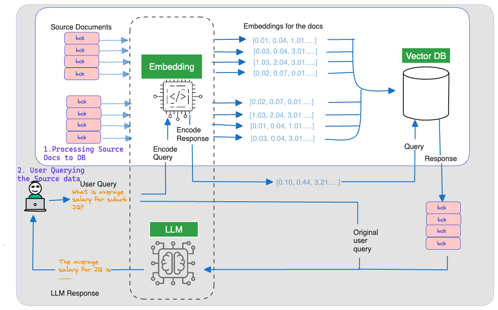

# Generative AI

We will cover series of generative ai tasks which include but not limited to:
- Retrieval-Augmented Generation (RAG)
- Retrieval-based Chatbots
- so on...

## Tasks

<h3>Retrieval Augmented Generation with LLM Part 1</h3>

RAG is a process of fetching up to date or context specific data from an external database and making it available to to an LLM when asking it to generate a response.  

To be able to do this, we need an open source language model, a vector database and a composer. Fortunately, there are freely available open source python libraries to create this solution. For simplicity, we will use the following:

* Pre-trained T5 model from Huggingface as LLM
* ChromaDB as vector database 
* Langchain as application tools.

Click [here](Retrieval_Augmented_Generation_with_LLM.ipynb) for more.

<h3>Retrieval Augmented Generation with LLM Part 2</h3>

Instead of using a pre-trained T5 model, we will use gpt4all models.

Click [here](Retrieval_Augmented_Generation_with_LLM_part_2.ipynb) for more.

## Hi, I'm Ade! 👋

## 🚀 About Me
I'm a full stack AI developer...

## Authors

- [@aakinlalu](https://www.github.com/aakinlalu)

## 🔗 Links

## Acknowledgements

 - [langchain](https://python.langchain.com/docs/get_started/introduction.html)
 - [GPT4ALL](https://gpt4all.io/index.html)